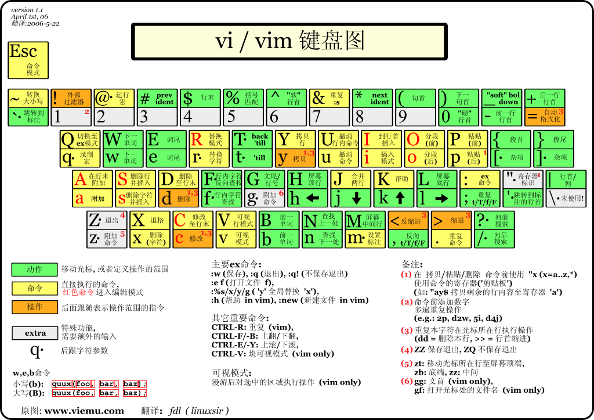

#### 打开或新建文件，并将光标置于第一行首
 - vi +n filename ：打开文件，并将光标置于第n行首
 - vi + filename ：打开文件，并将光标置于最后一行首
 - vi +/pattern filename：打开文件，并将光标置于第一个与pattern匹配的串处
 - vi -r filename ：在上次正用vi编辑时发生系统崩溃，恢复filename
 - vi filename….filename ：打开多个文件，依次进行编辑

#### 移动光标类命令
 - h ：光标左移一个字符
 - l ：光标右移一个字符
 - space：光标右移一个字符
 - Backspace：光标左移一个字符
 - k或Ctrl+p：光标上移一行
 - j或Ctrl+n ：光标下移一行
 - Enter ：光标下移一行
 - w或W ：光标右移一个字至字首
 - b或B ：光标左移一个字至字首
 - e或E ：光标右移一个字至字尾
 - ) ：光标移至句尾
 - ( ：光标移至句首
 - }：光标移至段落开头
 - {：光标移至段落结尾
 - nG：光标移至第n行首
 - n+：光标下移n行
 - n-：光标上移n行
 - n$：光标移至第n行尾
 - H ：光标移至屏幕顶行
 - M ：光标移至屏幕中间行
 - L ：光标移至屏幕最后行
 - 0：（注意是数字零）光标移至当前行首
 - $：光标移至当前行尾

 #### 屏幕翻滚类命令
 - Ctrl+u：向文件首翻半屏
 - Ctrl+d：向文件尾翻半屏
 - Ctrl+f：向文件尾翻一屏
 - Ctrl＋b；向文件首翻一屏
 - nz：将第n行滚至屏幕顶部，不指定n时将当前行滚至屏幕顶部。

 #### 插入文本类命令
 - i ：在光标前
 - I ：在当前行首
 - a：光标后
 - A：在当前行尾
 - o：在当前行之下新开一行
 - O：在当前行之上新开一行
 - r：替换当前字符
 - R：替换当前字符及其后的字符，直至按ESC键
 - s：从当前光标位置处开始，以输入的文本替代指定数目的字符
 - S：删除指定数目的行，并以所输入文本代替之
 - ncw或nCW：修改指定数目的字
 - nCC：修改指定数目的行
 - 删除命令
 - ndw或ndW：删除光标处开始及其后的n-1个字
 - do：删至行首
 - d$：删至行尾
 - ndd：删除当前行及其后n-1行
 - x或X：删除一个字符，x删除光标后的，而X删除光标前的
 - Ctrl+u：删除输入方式下所输入的文本

 #### 搜索及替换命令
 - /pattern：从光标开始处向文件尾搜索pattern
 - ?pattern：从光标开始处向文件首搜索pattern
 - n：在同一方向重复上一次搜索命令
 - N：在反方向上重复上一次搜索命令
 - ：s/p1/p2/g：将当前行中所有p1均用p2替代
 - ：n1,n2s/p1/p2/g：将第n1至n2行中所有p1均用p2替代
 - ：g/p1/s//p2/g：将文件中所有p1均用p2替换

 ##### 1. 基本的替换 
 - :s/vivian/sky/ 替换当前行第一个 vivian 为 sky 
 - :s/vivian/sky/g 替换当前行所有 vivian 为 sky 
 - :n,$s/vivian/sky/ 替换第 n 行开始到最后一行中每一行的第一个 vivian 为 sky 
 - :n,$s/vivian/sky/g 替换第 n 行开始到最后一行中每一行所有 vivian 为 sky 
 - （n 为数字，若 n 为 .，表示从当前行开始到最后一行） 
 - :%s/vivian/sky/（等同于 :g/vivian/s//sky/） 替换每一行的第一个 vivian 为 sky 
 - :%s/vivian/sky/g（等同于 :g/vivian/s//sky/g） 替换每一行中所有 vivian 为 sky 

 ##### 2. 可以使用 # 作为分隔符，此时中间出现的 / 不会作为分隔符 
 - :s#vivian/#sky/# 替换当前行第一个 vivian/ 为 sky/ 
 - :%s+/oradata/apras/+/user01/apras1+ （使用+ 来 替换 / ）： /oradata/apras/替换成/user01/apras1/ 

 ##### 3. 删除文本中的 
 - 问题描述：对于换行，window下用回车换行（0A0D）来表示，linux下是回车（0A）来表示。这样，将window上的文件拷到unix上用时，总会有个^M，请写个用在unix下的过滤windows文件的换行符（0D）的shell或c程序。 
 - 使用命令：cat filename1 | tr -d “^V^M” > newfile; 
 - 使用命令：sed -e “s/^V^M//” filename > outputfilename 
 - 需要注意的是在1、2两种方法中，^V和^M指的是Ctrl+V和Ctrl+M。你必须要手工进行输入，而不是粘贴。 
 - 在vi中处理：首先使用vi打开文件，然后按ESC键，接着输入命令： 
 - :%s/^V^M// 
 - :%s/^M$//g 
 - 如果上述方法无用，则正确的解决办法是： 
 - tr -d “\r” < src >dest 
 - tr -d “\015″ dest 
 - strings A>B 

#### 选项设置
 - all：列出所有选项设置情况
 - term：设置终端类型
 - ignorance：在搜索中忽略大小写
 - list：显示制表位(Ctrl+I)和行尾标志（$)
 - number：显示行号
 - report：显示由面向行的命令修改过的数目
 - terse：显示简短的警告信息
 - warn：在转到别的文件时若没保存当前文件则显示NO write信息
 - nomagic：允许在搜索模式中，使用前面不带“\”的特殊字符
 - nowrapscan：禁止vi在搜索到达文件两端时，又从另一端开始
 - mesg：允许vi显示其他用户用write写到自己终端上的信息

#### 后行方式命令
 - ：n1,n2 co n3：将n1行到n2行之间的内容拷贝到第n3行下
 - ：n1,n2 m n3：将n1行到n2行之间的内容移至到第n3行下
 - ：n1,n2 d ：将n1行到n2行之间的内容删除
 - ：w ：保存当前文件
 - ：e filename：打开文件filename进行编辑
 - ：x：保存当前文件并退出
 - ：q：退出vi
 - ：q!：不保存文件并退出vi
 - ：!command：执行shell命令command
 - ：n1,n2 w!command：将文件中n1行至n2行的内容作为command的输入并执行之，若不指定n1，n2，则表示将整个文件内容作为command的输入
 - ：r!command：将命令command的输出结果放到当前行

#### 寄存器操作
 - “?nyy：将当前行及其下n行的内容保存到寄存器？中，其中?为一个字母，n为一个数字
 - “?nyw：将当前行及其下n个字保存到寄存器？中，其中?为一个字母，n为一个数字
 - “?nyl：将当前行及其下n个字符保存到寄存器？中，其中?为一个字母，n为一个数字
 - “?p：取出寄存器？中的内容并将其放到光标位置处。这里？可以是一个字母，也可以是一个数字
 - ndd：将当前行及其下共n行文本删除，并将所删内容放到1号删除寄存器中。
